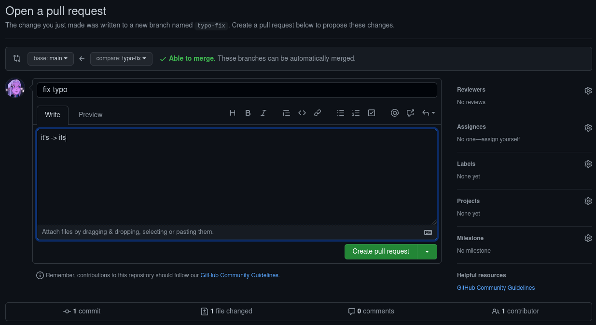

# Contributing

:+1::tada: First off, thanks for taking the time to contribute! :tada::+1:

Everyone is welcome to provide their own guides, tutorials, or propose changes towards the collection of information
that the site provides for the community. As your changes are documented through your commit history for your pull
request, a moderator will need to approve your changes (meaning that it's a good idea to test your changes!).

If you are new to github and [docfx](https://dotnet.github.io/docfx/index.html), you can request in your pull request (
your request for the wiki to pull your changes) for your changes to be tested by a moderator and the necessary measures
will be taken.

Now that that's taken care of...

## Forking the repo

In order for you to create changes and propose them, you will need to "check out" a version of the repository. Head on
over to [this link](https://github.com/H3VR-Modding/wiki) and click the "Fork" button.

After some time, you will have your own copy of the wiki under your own name.

## Suggesting changes

To suggest a change to a page, simple navigate to the page that you wish to edit on the repo. This can be done easily by
taking a look at the url of the page you wish to edit.

Here is an example:
`https://h3vr-modding.github.io/wiki/installing/specific_mod_installation.html`

If you see the url, we have our base (`h3vr-modding.github.io/wiki/`), which is our domain (where the repo root is),
then a set of folders and files. `installing/` means that the page is inside of the `installing/` folder, and then
the `specific_mod_installation.html` is the file you need to change. With the way that the site works, you will actually
be editing a markdown file (so in this case, `specific_mod_installation.md`).

So taking that into account, we get to the following file on the repo:
`src > users > specific_mod_installation.md`

Now that you know where the file is, open it and click on the little pencil icon in the top right of the document box.
Now you can edit the page however you like, and you can click the preview button at the top to see how it looks. Keep in
mind that some parts of the document are not rendered correctly in this view since it is
actually [DocFX Flavored Markdown](https://dotnet.github.io/docfx/spec/docfx_flavored_markdown.html).

Once you are done editing the page, scroll all the way to the bottom and write a descriptive message about what you did
and hit the `Commit changes` button. Select "Create a new branch for this commit and start a pull request." Then, give
your branch a simple name. Often times, this will overlap with your commit name.

Press the "Propose changes" button. This will open the pull request page, which allows you to describe your changes in
further and prettier detail. It should be obvious by your pull request title and description what you have changed.

Once you are ready to submit the request, press the "Create pull request" button. A team member will take a look at your
changes, suggest things, or modify it to comply, and then be added to the site.

You can also
read [this official Github page](https://docs.github.com/en/github/collaborating-with-pull-requests/proposing-changes-to-your-work-with-pull-requests/creating-a-pull-request)
to find out how to submit your changes.

## Adding pages

Adding pages to the website can be a bit tricky, so if you are less tech inclined you can contact one of the H3VR
Modding Documentation team members to add the page for you. Simply upload a zip of
your [markdown](https://github.com/adam-p/markdown-here/wiki/Markdown-Cheatsheet) file (.md file extension) that follows
our [formatting guidelines](formatting.md).

If you want to add pages yourself, there are a few recommended steps to take so that you can easily test your changes
and see how it works. Of course, these are only recommended, and you can skip the next header and add pages instead
manually through the github interface, just make sure that you follow the [formatting guidelines](formatting.md) in
either situation.

### Getting the environment setup

The next parts are up to yourself to figure out, but you now need to start creating files and folders. You can use any text editor, such as Visual Studio Code or Notepad++. 
You will also need to download a Git client which will be used to download and upload changes
to your version of the wiki. It's recommended you use GitHub Desktop.

After using your git client to clone your fork of the wiki to your computer, there's one more step. Navigate into the `tools` folder of the cloned repo and run `setup.bat`. This will download
the files needed to build the wiki locally.

### Building the site for testing

When you've made some changes and are ready to see them, run the `tools/serve.bat` file. This will take a second to build the wiki and then will host it on your computer for you to see.

Once you have opened up your page in your browser, hit `f12` on your keyboard, navigate to Network, and select "Disable
Cache". [!Disabling the cache](images/network_disablecache)

### Committing your changes

With your changes made, go back to GitHub Desktop and STAGE all of your changes, COMMIT them, then PUSH.
This will make your changes available on the GitHub website.

Next head on over
to [this official Github page](https://docs.github.com/en/github/collaborating-with-pull-requests/proposing-changes-to-your-work-with-pull-requests/creating-a-pull-request)
to find out how to submit your changes.
