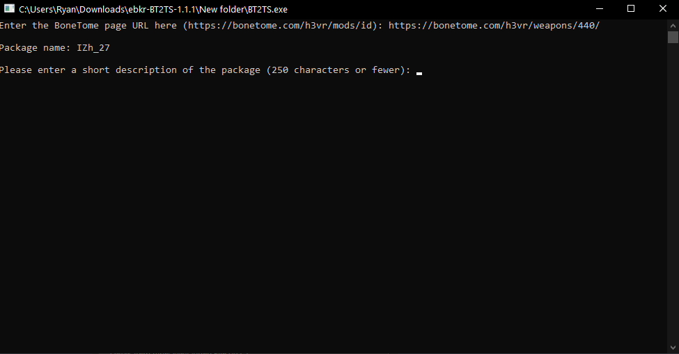
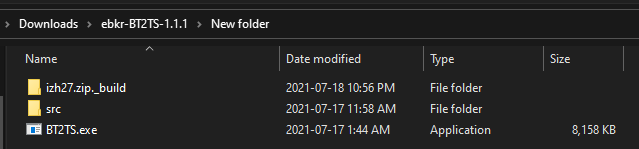
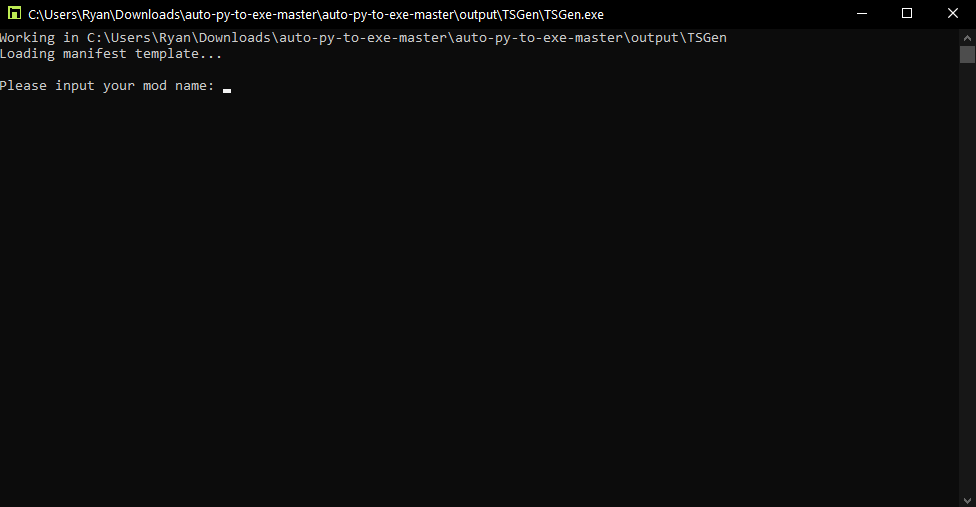
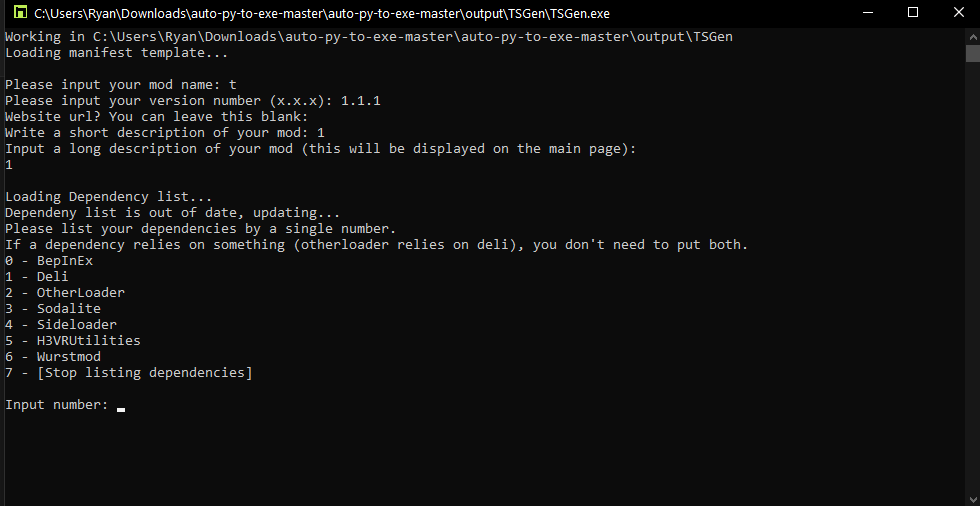

# Uploading a mod to Thunderstore

Depending on your situation, please click on the section below:

- [Uploading a mod to Thunderstore](#uploading-a-mod-to-thunderstore)
  - [My mod is on Bonetome](#my-mod-is-on-bonetome)
  - [My mod isn't on Bonetome](#my-mod-isnt-on-bonetome)

**NOTE:** Windows defender or other antivirus programs may interfere with the mentioned programs, either run them as administrator or let them through temporarily.

## My mod is on Bonetome

**NOTE:** This method only works when Bonetome is live, if it is down or your firewall blocks the site, use the [other method](#my-mod-isnt-on-bonetome) instead.

**CAUTION:** If you uploaded your mod as a `.7z`, make sure the program is listed in your system's `PATH`.

Since your mod is on Bonetome, you can use [Ebkr](https://github.com/ebkr)'s tool for generating the required files in the correct file structure called BT2TS ([Thunderstore](https://h3vr.thunderstore.io/package/ebkr/BT2TS/)) ([Github](https://github.com/ebkr/H3VR.BT2TS)).

Once downloaded, place `BT2TS.exe` and its `src/` folder inside of a folder you have permissions for. This can be done easily by creating a folder inside of your `Downloads/` folder. After running `BT2TS.exe`, you will be greeted by this screen:


After you input the Bonetome link of your mod, it will respond with the name of it and prompt you to include a short description of your mod:



Once inputted, you can add a website that will be displayed at the header of your mod page. This is mostly used for github pages, so you can leave this part blank (just press enter without typing anything). Below is an example of where this link is located:


Afterwards, you will be prompted with whether you want to package it for Thunderstore, or to use it for personal use. Type `1` and hit enter to create our required files.

You may be prompted for extra information depending on which type of mod `BT2TS` determines your mod to be.

**DONT PANIC:** After hitting enter, the window will close. This is normal.

If you had the correct permissions, it should create a folder beside `BT2TS.exe` called `[filenameOfYourMod]_build/`. Below is an example of a successful download:



If the program failed to create the folder of your mod, try running it as administrator or making sure your mods extension is supported by your OS.

Inside of the folder that was just created should be another folder named `plugins/` or `Sideloader/`, a `manifest.json` file, and a `README.md` file. You can open any of these and look around or change what your `README.md` file says (recommended to add pictures to your mod's main page, see the [markdown guide](https://www.markdownguide.org/basic-syntax/#images) to learn more).

After you are done, add an icon to the build folder named `icon.png` with a resolution of 256x256. It must be called this and have this resolution, failure to do so will result in your mod not being accepted by Thunderstore for upload.

Once you have added your icon, zip your files together and head on over to [Thunderstore](https://h3vr.thunderstore.io) to upload your mod. Make sure to log in, then press the `Upload` button in the top left. Set it's category, drag your `.zip`, and hit upload.

## My mod isn't on Bonetome

Head on over to [TSGen](https://github.com/nayr31/TSGen)'s github and download their latest release. You probably want to download `TSGen_Extract_This.zip` and extract it to it's own folder.

Running `TSGen.exe` will greet you with this page:



TSGen will prompt you for some general information about your mod:

- Mod name
- Version (It needs to be in the x.x.x format)
- Website url (usually for github links)
- Short description (displayed beside your mod in r2modman)
- Long description (displayed in the README file on the main page of your mod)

Next, it will prompt you for dependencies that your mod uses.



Input the number that corresponds to the top level dependencies you need.

Example:

```text
Mod A requires Wurstmod, Deli, and BepInEx

Wurstmod requires Deli

Deli requires BepInEx

So Mod A's dependencies are:
- Wurstmod
```


In the above picture you can see what the example would do in it's situation. You can close TSGen now by hitting enter or by closing the window.

Inside of the extracted TSGen folder, you should see a folder by the name of your mod:

```text
[You mod name]/
    icon.png
    manifest.json
    README.md
```

Depending on your mod type, you will need to package your mod differently by using folders:

- Deli mods
  - No folder needed, place your `.deli` file inside of your mod folder
  
  ```text
    [You mod name]/
        asset1.deli
        asset2.deli
        icon.png
        manifest.json
        README.md
    ```

- Sideloader mods
  - Place your `.h3mod` or `.hotmod` file inside of a folder called `Sideloader` inside of your mod folder

  ```text
    [You mod name]/
        Sideloader/
            asset1.h3mod
            asset2.hotmod
        icon.png
        manifest.json
        README.md
    ```

- Asset bundles
  - These are unsupported as of Otherloader 0.3.0, please wait for an update for them to be compatible
  - Place your assets inside of a folder inside of your mod folder called `LegacyVirtualObjects/`.

    ```text
    [You mod name]/
        LegacyVirtualObjects/
            asset
            asset.manifest (optional)
        icon.png
        manifest.json
        README.md
    ```

Now that your files are compiled together, zip your files together and head on over to [Thunderstore](https://h3vr.thunderstore.io) to upload your mod. Make sure to log in, then press the `Upload` button in the top left. Set it's category, drag your `.zip`, and hit upload.
