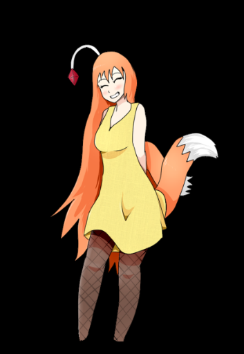
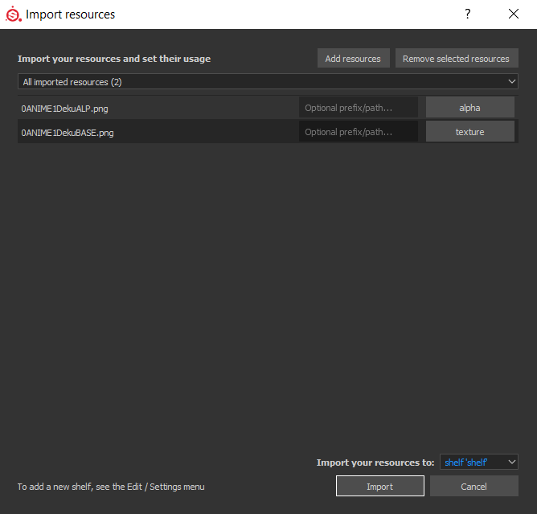

[A video guide on making stamps](https://www.youtube.com/watch?v=O6ez1inRDK8), made by Moorus.

If you have a image in mind which you want to implement to your skin, you'll have to convert it into a stamp!

This will need some sort of image editing software, such as Photoshop or GIMP

When you have one of these options:

File --> New

Make a 2048 x 2048 image

Make the background completely black

Then import your image

The example I'll be using is one of my own artworks (credit where credit is due! I'll remind you in the bottom of this
tutorial)

Your example should be centered, with an all black background

Save it as a png with any name

Afterwards, highlight your stamp in all white, just like this

Save with a similar name to your first picture, with "alp, alpha, or A" added onto it

The first picture is your color. The second picture is your alpha, the tool needed to post the color onto your canvas

Once you have both of these pngs ready, exit out of your image editing software and load up Substance Painter.

Drag the two PNGs you made, color and alpha, into the shelf of Substance painter

A window will pop up

There are details for you to fill

For your alpha, classify it as an alpha among the four choices available

For your color, classify it as a texture among the four choices available

The location of these resources, select as "Project" if you want to specify that it only belongs to the certain gun you
are working on. If you want it available for all the projects you plan to work on, select "shelf"

So it should look something like this in the end.

When it does, click "Import"

Now, the images should be available as an Alpha and Base Color!

> [!NOTE]
> For public releases of skins, if images used as stamps are not original works, I 100% recommend for you to leave the source of the images used, something like a txt file associated with the hotmod/zip file of the skin. Or, leave a source in the Bonetome Submission Description if you plan on making it public with Bonetome. If the skin is a duplicate of a gun skin from another game, mention that it is a recreation of the skin from said game.
