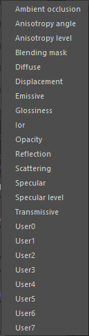
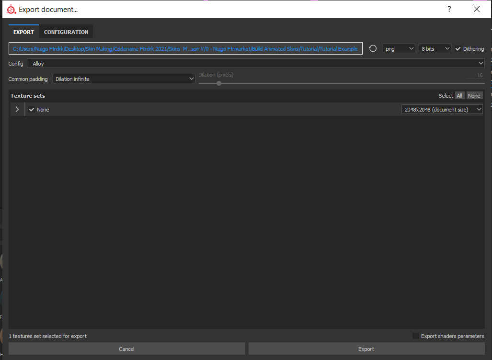
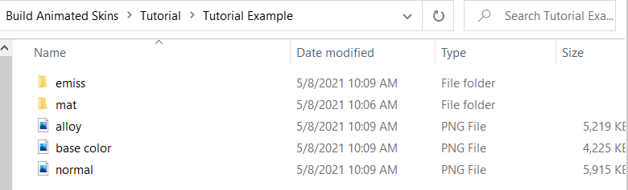
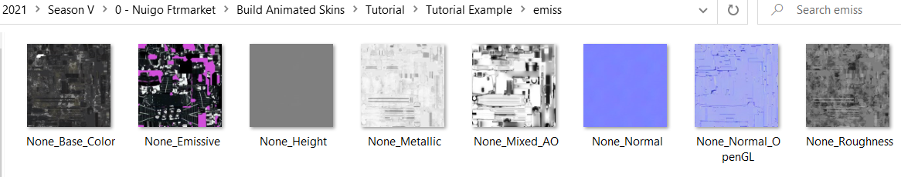
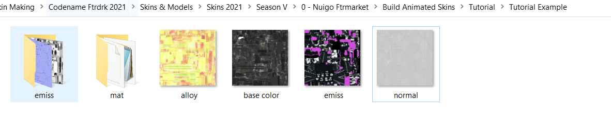
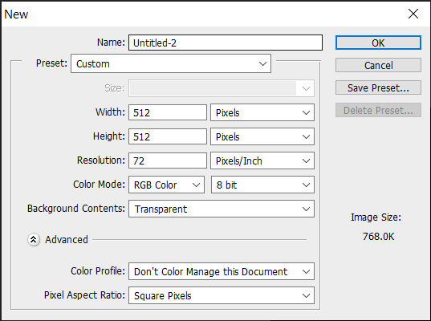

If you want to go the extra mile, you can make animated skins for H3VR as well. Before I explain how:

You'll be needing Unity in addition to what you currently have.

Oh, and Skinpacker won't work from this point on, sorry! You're going to need a ZIP Program!

[Unity 5.6.3f1](https://unity3d.com/get-unity/download/archive) is the version I used (Unity 5.x category).

You'll also need a template for H3VR stuffs, here
is [one from PhoenixCraft99](https://drive.google.com/file/d/1bRHZrJxgPmE1PJGR_ty3i78mBfLTZQiB/view?usp=sharing).

Once you get these up and running, move on to the first step:

## Step 1 - Enabling Emissions for Substance Painter

At this point it is recommended for you to be using Substance Painter, so that the tutorial can be easily understood and
things move smoothly.

On Substance Painter, you should have your canvas open with the usual instructions (New Canvas with Normal Texture, Bake
Maps, Include Normal post-bake)

There is one addition to this process for when you want to make animated skins.

Over on these texture set settings, click on the plus sign next to "Channels

Select "Emissive"

Your result should look like this. With this, you have enabled Emissives for Substance Painter. Now, what to do with
that...

## Step 2 - Applying Emissions (Automatic vs. Custom)

Now, there are two ways you can add Emissions to your canvas.

The easier way is through Materials and Smart Materials, the **Automatic** choice.

Some SMs and Materials come with emissions included in them. (There is a starter pack with SMs and Materials included in
Extras!)

Drag n Drop. Boom. Done. Easy.

However, if you have a bit more in mind, you can make your own **Custom** Emissives.

First, make a new layer dedicated to these emissions.

Using the advanced tricks above, stamps and the material settings become handy. Notice the "emiss" selection? That's
new, and that's what we'll need. Enable that, and if you want your stamp exclusively for the animated skin part, disable
everything else,

After doing this, painting anything now will be included in an Emission category, and the Alloy export you're used to
will not detect these emissions.

## Step 3 - Exporting... Twice

After you make a skin, you need to export it a bit differently, too. You'll need to export twice.

Once with the **Alloy** Preset.

Then the next being with preset Document Channels.

I recommend having these exports in separate locations. My Alloy was sent here, but my second export I placed in the "
emiss" folder. Don't you like having things organized? Me too.

Visiting said folder, this is what the export looks like. The only one we're interested in is our emission export, in
which this example is called "None_Emissive".

I recommend renaming it to emiss before moving it with the alloy export. That's how you make an Emission! Now, the next
part...

## Step 4 - Incandescence, the map of Animation

> [!NOTE]
> The starter pack will include a bundle of Incandescence PNGs, so you can skip this part if you already have one that works with your skin.

To bring these emissions to light, you need a fifth png. A black and white png that scrolls through the Emissive texture
in variating opacities, giving it that "animated" effect.

To make it, you could even use Microsoft Paint! But for this example, we'll be using Photoshop.

For most Incandescence Maps, they are 512 x 512, a fourth of the size of the exports.

Start off with a black background, and make a picture of how you want your emissions revealed, then make that effect on
here.

This is my example of an incandescence map, yours can be different, but so long as it follows the same rules (black and
white, 512 x 512) it should work.

(If your canvas has a map that translates well, you could make a 2048 x 2048 map with variating Incandescence maps.
However, this might not work for all canvases)

Save it as "incan.png" with the other four exports. Now that we have the last piece, we can move on to Unity!

Step 5 and 6 have been moved to their own pages.

On to [Animated Skins - Unity](animated_unity.md).
