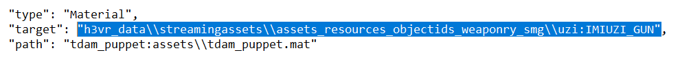

(An example manifest and a manifest template will be included in the starter pack!)

In you "mat" folder, bring out the file built by Unity.

Homestretch. Five PNGs, one "Material" file... Now we need a manifest.


Open SkinPacker, and locate this location, and have it generate a manifest for you.

guid - "a"

name - "a"

version - "1.0.0"

save manifest

Why the low effort? Unfortunately, I have some bad news.

You cannot use SkinPacker here...

Skinpacker only works with Textures. It kicks the can when you include anything else.

So, after saving the manifest, close SkinPacker.

We're gonna get hands on now...

Open the Manifest.

It should look something like this, right?


Here's an incoming wall of text that you'll be copying and replacing these details, because, good news!

The format of making animated skins this way is near identical to one another!

```json
{
  "manifestRevision": "1",
  "guid": "[name]",
  "name": "[Name]",
  "version": "1.0.0",
  "description": "[Description]",
  "assetMappings": [
    {
      "type": "Material",
      "target": "h3vr_data\\streamingassets\\assets_resources_objectids_weaponry_[category]\\[gun]:[gun mat]",
      "path": "[bundle name]:assets\\[mat name].mat"
    },
    {
      "type": "Texture",
      "target": ":[mat name]::_MainTex",
      "path": "base color.png"
    },
    {
      "type": "Texture",
      "target": ":[mat name]::_SpecTex",
      "path": "alloy.png"
    },
    {
      "type": "Texture",
      "target": ":[mat name]::_BumpMap",
      "path": "normal.png"
    },
    {
      "type": "Texture",
      "target": ":[mat name]::_EmissionMap",
      "path": "emiss.png"
    },
    {
      "type": "Texture",
      "target": ":[mat name]::_IncandescenceMap",
      "path": "incan.png"
    }
  ]
}
```

Copy that json for your manifest.

Now that it's like this, lets break it down.


Guid --> Sideloader ID, needs to be lowercase and with either underscores or periods, no spaces

Name & Description --> self-explanatory

Target is very important, the trickiest part of this process... this is the prefab path and material name of the gun you
are making a skin for.

To assist,
use [this spreadsheet](https://docs.google.com/spreadsheets/d/1Mjeo410-2wgou9JHSb_I1VltNTyzNXZX_EwhMNsfH6Y/edit#gid=1966002968)
made by Ghorsington.

But for my example, I am making a skin for the Uzi, so my target would be


**Category** becomes "Smgs" , **Gun** becomes uzi, and **gun mat** becomes IMIUZI_GUN



Target's down, next is path.

If you named your asset bundle and material name the same, and have your material in the assets folder just as this
tutorial instructed, then this is going to be a sinch!

However, if you stored your material in a subfolder of "Assets", it's gonna be a bit more tricky

`[bundle name]:assets\\[mat name].mat` --> `[bundle name]:assets\\[subfolder]\\[mat name].mat`

This is why I keep it in assets because it makes it less confusing!

ANYWAY

The name you used on both is what **bundle name** and **mat name** becomes!

My example is "tdam_puppet", so I replace it all [] portions with tdam_puppet.

Here is the final product of my example, yours should hopefully follow the same pattern!


Save the manifest and exit out.

The final step of the final step is to manually make a hotmod.

Select all seven items in your folder, the five textures, the manifest, and the unity file we dubbed as the "material"
file.


Use a ZIP program [WINRAR, Bandizip, etc] to package all the materials into a ZIP.

Rename the .zip to .hotmod or .h3mod

And it's ready to go! That's the process of making animated skins for H3VR! Hope it wasn't too taxing and I hope you
make the most of it!
