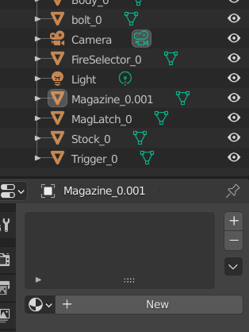

Now that you have both the textures and meshes, we can move to the next big step!

Close UABE and Open Blender!

Once it's open, delete that general square!

Go up to File --> Import

Import the files based on what type you saved it as.

One by one by one, and as you go, space the meshes so that there a few inches away from one another.

If you have a receiver, or a main portion, make that the center of it all.

When you got all the meshes into the scene, this next part might confuse you

Select the first mesh on your list of items in the "scene"

Locate these options on your toolbar

That red orb? Click on it.

It will open up a small list, and will have one line that states a material.

Delete that material by hitting the "-" button.

It your list should now look like this.

Do this for every single mesh in your scene!

After you do that, then your canvas will be ready for the next step!

Save your blender project wherever you want (Under Workshop if you have a dedicated folder, call it [NAME OF ITEM]
.blend)

Then, export your canvas as an OBJ file (This will also go to your Workshop folder)

Next up, [Step 4 - Painting](basics_4_painting.md).
