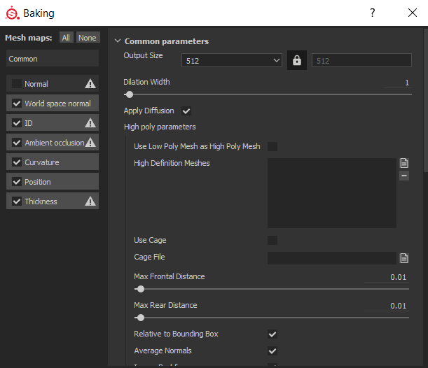
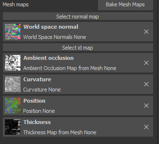

Now we can get on to the fun stuff!

Close Blender

Open Substance Painter

If this is your first time loading up Substance Painter, this is where that Alloy.spexp file comes in

Locate that file and drop it into Substance Painter's "Shelf" tab.

A page will pop up, and Alloy will be auto-determined as an "Export"

To the bottom right, right next to "Import your resources to", select "Shelf"

This will save the export as a permanent feature for all your Substance Painter projects!

Now, the next step:

File --> New

A page will pop up, asking for your Canvas and any additional PNGs for your project.

The first browse option, select the canvas you made using Blender

The second, lower option, click on that and find the normal map that belongs to your item.

Once you have both of these, select 'OK'!

The canvas should now appear on both the 3D View and UV (2D) View.

Don't jump into making a skin just yet though!

Locate "Texture Set Settings" on your toolbar.

Scroll down until you find the "Bake Mesh Maps" option.

This pop up will appear. Your pop up with have "Normal" checked. Un-check that before you bake.

After the baking is done, this should be a result. We're not quite done just yet.

Hit on "Select Normal Map", and locate that Normal Map you chose when you selected your canvas.

If your project looks similar to this, your canvas is ready to be painted on!

Next up, [Step 5 - Exporting](basics_5_exporting.md).
