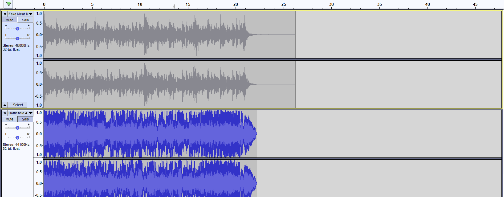
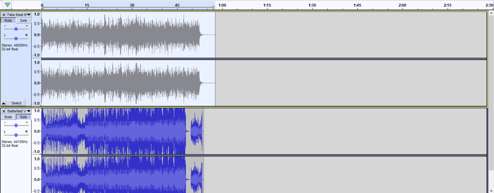
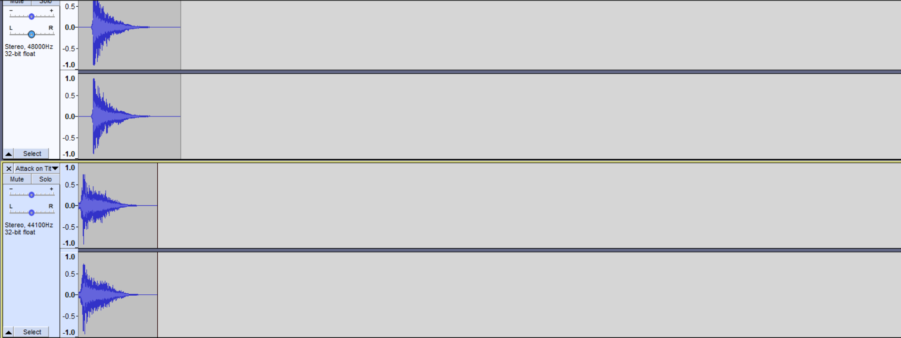
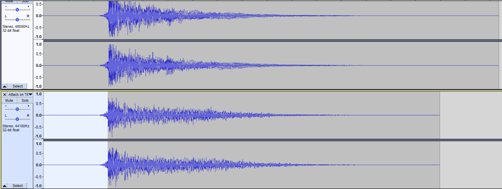

> [!NOTE]
> [Potatoes TNH BGM Loader](https://h3vr.thunderstore.io/package/Potatoes/Potatoes_TNH_BGM_Loader/) is required for these types of mods to work. Check out the [Thunderstore creation](../../thunderstore/creating.md#tnh-music) page more more details on what your Thunderstore package should look like before uploading.

Hiya! This is the tutorial to make your own TNH hold themes.

No mods are actually required, it is just replacing a single file with H3VR's data.

TNH Hold Music can be pretty much any song if you go the extra mile to make it. (Its a bit tougher to use a song with
lyrics, but doable!)

Lets start off by getting the right software:

[Audacity](https://www.audacityteam.org/download/) (recommended, but any audio edit software can work)

[FMOD Bank Tool](http://www.rugbyleaguemods.net/downloads/miscellaneous/Fmod%20Bank%20Tools.zip)

## Step 1 - The Foundation

You will also need to locate a certain file in your H3VR Folder

Inside the H3VR Folder, go through these two folders

H3vr_Data --> StreamingAssets

Inside StreamingAssets is where BANK files are located

The BANK file we are looking for is MX_TAH.bank

Copy this file and paste it in a dedicated location, such as a folder in your desktop called "Custom TNH Music"

## Step 2 - The Vanilla Folder

We'll be giving the Fmod tool a spin, so you can understand what this tool is capable of!

First, your MX_TAH file is sitting by itself, lets change that

Make a folder called "Vanilla"

Drop the MX_TAH file inside "Vanilla"

Boom, done, easy

Now, find where your FMOD bank tools are, and put them in the dedicated folder, next to the "Vanilla" folder

Next, after you move the Fmod tools folder, open your Fmod tools "Fmod Bank Tools.exe"

A small popup will appear. Two long bars, three buttons, nothing crazy.

"Bank Source Folder" and "Wav Destination Folder"

There will be an option to select off to the side, and this option will open a browse window

Choose the "Vanilla Bank File" Folder for both of these options

Afterwards, for the three buttons down below, hit "Extract"

This will bring the WAV files out from the Bank file for you to edit!

These files will be in a folder called "MX_TAH", identical name to the bank file.

Once the Fmod tool is done, this is what you'll wanna do next.

Make a copy of your Vanilla Bank File folder now that it has the extracted parts inside

Rename that folder to the name of your song, album, artist, etc + Bank File

In the tutorial, I'll call it your Custom TNH Folder

Once thats all set, we are ready for the most important part - matching your song with TNH!

## Step 3 - Setting up with Audacity

Next, it's time to use Audacity!

You're going to want to open it twice, making two Audacity windows

One window, you'll put your music in

Drag your music file and drop it into this window, it'll load in

If your waveform is huge (if it's a loud song), select the entire song

"Effects" --> Amplify

Bring it down by -3 to -6 so that it doesn't blare too loud in-game

Now that that's set

The other window, your workshop

You'll be working each part of the Hold theme with this window

Go to your Custom TNH Folder and find the extracted files

There are 90+ files, but don't be overwhelmed, there are five that we're going to edit

Fake Meat Must Die-14, and it's five parts are.

Intro, Lo, Transition, MedHi, and Ending

There are "Rules" to the wav files. If you ignore them, the results may be a sound file mess.

Please play close attention to the following instructions.

Lets get to work

## Step 4 - Intro

Lets get started with the "Intro" WAV file

Find the "Fake Meat Must Die-14 - Intro" File and drag n drop it in your second, empty Audacity Window

This particular file happens when the hold begins

It does not loop and only plays once, meaning the start of your file can be whatever

However, it does have a dedicated end time at 21 - 22 seconds

If you are too short on the time, it will result in a breach of silence.

If you are too long on the time, it will overlap with the next part we'll be working on.

You're going to find an ideal part of YOUR song that you think would work well as an intro to the Hold sequence.

So find a part in your song's Audacity window, highlight it from start to finish...

Then paste it under the Vanilla Intro file.

Match the file length accordingly. 21 seconds is a safe place, but you can stretch it to 22 seconds.

You can use Silence as a means to extend the length. "Generate" --> Generate Silence

You can use the Fade Out effect to match the vanilla file, I recommend it. "Effect" --> Fade Out

Once you have your custom Intro file ready, you can remove the vanilla file by hitting the 'X' on the top left of the
waveform entry (right next to the name of the sound file)

Here is how you'll export it

File --> Export --> Export as WAV

Locate your Custom TNH Music folder --> MX_TAH

Select "Fake Meat Must Die-14 - Intro", you will be replacing this file

Make sure the WAV encoding format is "Signed 16-bit PCM"

Export, and boom, that's the intro

Delete your custom intro from the Audacity window so that it's blank again.

Next part!

## Step 5 - Lo

The next one we'll be doing is what I think is the trickiest part.

This is the looping sequence dedicated to the first hold.

It is also 21 - 22 seconds long, and it loops, so the part you'll use will likely be the chorus or the catchy part

For the empty Audacity window, locate the file "Fake Meat Must Die-14 - Lo", and drop it inside the empty Audacity
window

Next, locate a part of your song that you think can be a good looping part of the first hold.

Copy that part to the best of your ability and paste it under the vanilla Lo file.

When matching the lengths, you cannot use the silence trick from earlier to extend the song length, the loops will be
affected and the flow of the song will be tarnished

You can use a part thats 22 - 24 seconds long by making the start of this tune fade in, and the ending fade out, both
can be found in the effects tab

It takes a bit to get this part just right, but when you are ready to export, it will follow the same rules as how you
exported the Intro file.

Delete the Vanilla Lo file by hitting the 'X' in the top left of the waveform, next to the name

File --> Export

Locate Custom TNH Folder

Name of the file is "Fake Meat Must Die-14 - Lo"

Encoding is 16-Bit Signed PCM

Export

These methods will be the same for the other sound files, so the next step will be simplified

## Step 6 - Transition, MedHi, End's Rules

The last three files are

"Fake Meat Must Die-14 - Transition"

"Fake Meat Must Die-14 - MedHi"

"Fake Meat Must Die-14 - End"

Transition happens when a hold is bigger than one round. After completing the first hold, the "Lo" theme cuts off, and
this part will play

It is 5-6 seconds long

It will not loop, but silence in the start of this part will cut the Lo theme and ruin the flow

Fade Ins at the start will do the same.

MedHi has the most freedom of all the parts. It is also the one that is heard the most. It is the theme that plays
during holds 2 and beyond.

It is 51 - 52 seconds long, and it does loop as well.

You can use your favorite part of your song here.

No silence tricks because it is a loop, but a fade-in intro and fade-out end can work if your part is a bit bigger than
51 - 52 seconds

End is self explanatory, but it will look strange when you put it on audacity

It has a two second gap of silence. This gap is integral to how Anton made his Hold theme

When putting the ending to your song under this vanilla file, you can copy the silence and the fade in bit, then apply
it to your song ending to save the trouble

The ending itself is like two seconds after the two second silence, but you can stretch this out to five or further
because no other hold themes will occur after this part.

All these parts get exported the same as the first two.

Once you have all five WAV files edited with your song, we now can finish this project!

## Step 7 - Repack and Install

In the Fmod Bank Tools window, ets change our folder destination now

We originally had both parts on the Vanilla folder

Lets change both parts to your Custom TNH Music Folder

After you change the destination, there are two other buttons we have not touched.

The button we'll push is "Rebuild".

Hitting this, the tool will replace the MX_TAH.bank file inside with the parts of the Extract folder

A small console popup should appear if the locations are correct.

When the tool finishes, the MX_TAH file will be of a different file size compared to the Vanilla bank file.

Rename your MX_TAH file to `MX_TAH_[YourSongNameHere]`, and you are ready to package it as a Thunderstore mod! Remember,
it will require Potatoes' TNH BGM Loader, so add that as a dependency.

Alternatively, if you want to manually override your TNH sounds, copy this custom Bank file (while it is named MX_TAH),
then go to the H3VR directory

H3VR_Data --> StreamingAssets

Pasting this file replaces the vanilla file, so having the Vanilla folder back in your workshop and its bank file is
your way of reverting this change.

We are finished! Thats the tutorial, have fun!
