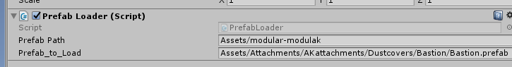

This tutorial assumes you know how to implement weapons in unity on a basic level. If you don't, check out Andrew_FTW's
tutorial. A link can be found in the [Making Mods](../../making_mods.md) doc. This tutorial also assumes you are using
one of the default AK/AR/P226 platforms to make your mod. If you aren't, just make more attachment mounts like standard
piccaninny rails.

You will need [AssetStudioGUI](https://drive.google.com/file/d/18P59DJL0tGRSTXaxXknVl9lFiLJ27Y_v/view).

In this tutorial, I need to properly mount a dustcover on my modular SVD.

## Importing prefabs

The first thing we will need is the basis of where a dustcover sits, modular AK. Once you have obtained the mod and
its `.manifest` file, place them in your Unity project's `Assets/` folder.

Then, I made another empty game object with the prefab loader script component. If you don't have one, you can
right-click in the `Hierarchy` on the left and click the `Create Empty` button. Once selected, in the `Inspector` tab on
the right click on the `Add Component` button and search for the prefab loader script.

Once you have a prefab loader object ready, fill it out with the fields you need. For this example, I need to load
the `modular-modulak` asset bundle and grab a dustcover that we are referencing.

1. Open the `.manifest` file in any notepad program.
2. Find the `.prefab` path you want to copy. Note: `.asset`s cannot be used.
3. Fill in your prefab loader object with the path to your asset bundle you are extracting from, and the path you copied
   from its `.manifest` file.

For this example, my prefab loader looks like this:

## Copying reference prefabs

Once you have your prefab loader setup, you'll next need to load the object. Press the pause, then play button in the
top middle of your screen.

This will load the object you want to copy into unity in "Play mode". Keep in mind, any changes you preform in "Play
mode" cannot be saved, so read carefully.

Next, drag and drop the clone of the item into your assets tray, just like you would do any other item or weapon. We
will be using this attachment as reference when placing our attachment mount. You can press play now.

Now its time to open AssetStudioGUI and rip the model of the prefab we are using. You can also rip the textures and make
a material so it's easier to visualize, its up to you.

To rip the mesh or materials:

1. Drag and drop the asset bundle you are ripping from into the main window of AssetStudioGUI.
2. Click on the `Asset List` tab.
3. Sort by `Type`.
4. Scroll and click on different `mesh` types until you find the one that matches what you are importing. Alternatively,
   you can search for it using the search bar, but it is not guaranteed that the assets are named correctly.
5. Right click on the selected assets and hit `Export selected assets`.
6. Browse to your unity project and hit save.

Drop in your clone into the hierarchy and navigate to where the creator placed their mesh and material in and fill them
in. Below is an image of this process completed.

## Placing the attachment mount

Take note of what attachment mount your attachment uses. For this case, a dustcover would use the `Russian` type.

If yours is blank, then that means the creator used a custom enum for their mount type. This is used to make sure no
other attachment can be placed in that spot. You will have to contact the creator of the mod for the enum number that
they used for that attachment mount and fill in your `FVRFireArmAttachmentMountType.cs` script with another entry with
that number that they provide.

Now we have some options. We can:

- Import the receiver of the firearm we are copying.
- Make a new rail and change the attachment mount to that mount type.

Either way, you still need to import another prefab. Lets go with option 1. In my case, that would be any of the modular
AK receivers.

Same as last time, pause play with the new `.manifest` path of the receiver in the prefab loader. This time however, all
we need to do is save the attachment mount that mounts our attachment. In my case, that would be the one shown in the
picture below:

Drag and drop that attachment mount (not the weapon itself) into your assets tray. Next, drag it onto your firearm that
needs the mount, and then place the attachment that you want to make compatible as a child to it. Below is how mine
would look:

Next, click on the attachment (in my case, `Bastion (Clone)`), and set the position of the transform to 0,0,0. Now move
the mount point (in my case, `_RailMount_Dustcover`) so that it fits on your weapon like it looks like it should.

Delete the object reference, and apply your main prefab to save it. Make sure to add the attachment mount to your main
script's `Attachment Mounts` list of attachment mounts, and thats it!

Here is an example of a completed modular weapon with all of its mounts.

## Finishing notes

Looking to get more out of your modular mod? Check the remaining articles of the Modul collection.

If you have any questions about this guide, you can ask me on discord @gamernayr#8165 through the official H3VR discord.
