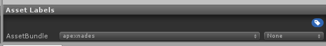
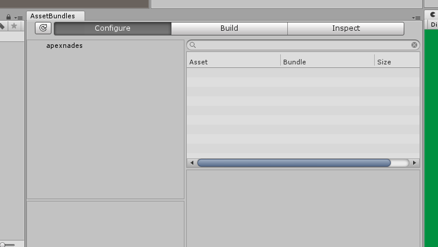

This document is meant as a quick reference guide, and should not be substituted for a comprehensive tutorial.

## Required/Recommended tools

You need Unity version 5.6.3. This is **non-negotiable**. Any patch version is compatible (p4, f). The link to the Unity
version archive can be found [here](https://unity3d.com/get-unity/download/archive).

[AssetStudioGUI](https://drive.google.com/file/d/18P59DJL0tGRSTXaxXknVl9lFiLJ27Y_v/view) is an extremely useful tool for
exporting packaged meshes and textures.

The [H3 Unity Template](https://drive.google.com/file/d/1bRHZrJxgPmE1PJGR_ty3i78mBfLTZQiB/view?usp=sharing) contains all
scripts and stubs for you to create firearms or other objects.

Once you have these, open Unity then open the folder of the template as a Unity project.

## Unity Window Types

There are a few types of windows inside of the unity editor.

Inspector

- The Inspector window shows you the details of the object you have selected.

Hierarchy

- The Hierarchy shows the parent child relationships of your objects in the scene.
- Objects that are selected here are not saved automatically, and must be applied through the Inspector window.

Game

- This window shows what the camera in your scene is seeing.
- Useful for taking pictures.

Scene

- The Scene is a display of the objects in your hierarchy.
- You can use the edit tools (move, rotate, etc.) in the top left of the Unity window to modify the objects placed in
  the scene.

Project

- Commonly known as the Assets Tray, this area shows your file structure and saved prefabs.

Asset bundles

- This window shows what asset labels you have and which items are included in them.
- In the build section, you can build your asset labels to be used and shared.

## Importing prefabs

Got an item in mind that you want to make? Think of an item already in the game that is most like it, and which class it
would belong in (melee, smg, rifle, etc.). Open your file explorer and go to your root H3VR folder, then navigate
to `H3VR/h3vr_data/StreamingAssets/` and find that file. For example, if you wanted to make an smg, you would want to
copy the `assets_resources_objectids_weaponry_smg` and `assets_resources_objectids_weaponry_smg.manifest` file.

Paste those files inside of your H3 unity template under assets (`H3 Unity Template/Assets/`).

You should have empty game object with the prefab loader script component in the unity window. If you don't have one,
you can right-click in the `Hierarchy` on the left and click the `Create Empty` button. Once selected, in
the `Inspector` tab on the right, click on the `Add Component` button and search for the prefab loader script.

Once you have a prefab loader object ready, fill it out with the fields you need.

1. Open the `.manifest` file in any notepad program.
2. Find the `.prefab` path you want to copy. Note: `.asset`s cannot be used.
3. Fill in your prefab loader object with the path to your asset bundle you are extracting from, and the path you copied
   from its `.manifest` file.

For example:

Prefab Path: `Assets/assets_resources_objectids_weaponry_smg`

This is the location of the bundle you copied into your Unity project.

Prefab_to_Load: `Assets/Weaponry/SMGClosedBolt/Mp9.prefab`

This is the path copied from the manifest file.

Press the pause button then the play button at the top of the screen, then drag the clone into your assets tray.

## Importing assets

Importing assets is as easy as copying them to your Unity project. Its recommended to make them under a recognizable
folder, such as `Materials`. This can be done by dragging and dropping them into the Assets tray, or by opening your
OS's file explorer and copying them through there.

Assets can range from textures, meshes, or sounds.

**Alloy** is the lighting system that H3VR uses, and because of that we need to create special materials to make sure
that the item you are trying to create renders correctly.

Right click in the assets tray and click `Create > Material` and rename it to the name of the item you are creating.
When you click on it, change the type to `Alloy/Core`.

From here, you need to fill in the three fields in the material. It needs a base/diffuse, a metal texture, and a normal.
If you don't have a metal texture (which is 99% of cases) then you need to make one. Head on over to
the `Material Map Channel Packer` in the window tab.

In the window that opens, drag your textures into the required fields. The normal is not required. After you hit
generate, you will obtain a metal texture. Fill you material with your texture sets now (base/diffuse, metal, and
normal).

## Modifying your item

> [!NOTE]
> GameObjects in your Hierarchy window are not saved, make sure to press the "Apply" button in the Inspector to save your changes.

Drag your item (that you should have renamed) into your Hierarchy, and expand it by clicking on the little arrow. You
should see a lot of other items underneath it. Those are the children of your object that make up it.

Depending on the child, you might need to fill in a missing mesh or material depending on what kind of item you are
creating.

When you select your item in the Hierarchy, you should see some green wire boxes. These boxes are physics colliders.
Make sure they are somewhat accurate, but don't spend too much time since they only need to be somewhat accurate.

To add more, you can duplicate ones already made (by right-clicking in the Hierarchy and clicking duplicate) or by
creating an empty game object (also in the Hierarchy) and adding the component you want in the Inspector window.

> [!WARNING]
> Using anything other than sphere, capsule, or box colliders effects performance considerably. Avoid them at all costs.

Everything is dependent on the type of item you are trying to create, which cannot be explained in a guide like this.
You will have to figure out the specifics on your own.

## Required Assets

To make sure your weapon works, you need to give it an object wrapper (found in the main script). The object wrapper is
simply an object id, something that defines your item.

Among the item id, you also need:

- Item Spawner ID

And depending on the if the item is a firearm or not:

- Recoil profile
- Audio profile

## Filling out the specifics

This next section will go over what needs to be filled out in each file detailed above. Included are example `.zip`
files that include an empty script object and it's associated `.meta` file. You can extract these into your Unity
project for reference and duplication. If for whatever reason the scrip file is empty, click on the little circle in the
Inspector window and browse for the correct name of the script and press enter.

### Item ID

[Script example download](https://github.com/H3VR-Modding/wiki/raw/main/src/creating/implementing/files/file_ID.zip). Script name: `FVRObject`

The Item ID requires a few fields to be filled out:

Asset Name:
Location of your item relative to your Unity assets path. Example: `Assets/Project/MyGun/MyGun.prefab`

Item ID, Display Name, Spawned From ID:
Identifiers of your item. To avoid confusion, should all be the same.

The rest of the fields should be filled out to your discretion. They are tags that relate to Take and Hold, so if you
want your item to spawn in it they need to be filled out.

Finally, if you want your item to spawn in TnH, enabled the `O Sple` property.

### Item Spawner ID

[Script example download](https://github.com/H3VR-Modding/wiki/raw/main/src/creating/implementing/files/file_ISID.zip). Script name: `ItemSpawnerID`

The ISID can be made through the assets tray `Create > ItemSpawner > ID`, and the icon is just an image that has its
metadata changed to be a sprite (clicking on the icon and changing the type in the inspector).

Make sure that you have `Is Displayed In Main Entry` and `Is Unlocked By Default` are set to true. This will allow you
to see your item and spawn it. Set it's category and sub category so that you can find it (make sure that you set it to
something used in the game already or else it won't load correctly). Set the sub heading to something you want, but its
not required.

Fill out the icon with the one you made (not required), and set the `Item ID` field to the exact same string you used in
the Item ID object just above. Drag your item id object into the `Main Object` field.

### Recoil profile

[Script example download](https://github.com/H3VR-Modding/wiki/raw/main/src/creating/implementing/files/file_Recoil.zip). Script name: `FVRFireArmRecoilProfile`

This is just a bunch of number fields that determine your weapon's recoil.

If you want to simulate your referenced weapon, the follow the following steps:

1. Press pause, then play to spawn prefab load the object.
2. In the Hierarchy, click on the newly cloned weapon.
3. Scroll down in the Inspector window until you find the location of the recoil profile that is required by all
   weapons.
4. Double click on it.
5. The Inspector should have changed to show your referenced weapon's recoil profile. Take a screenshot
   using `win + shift + s`, or any other snipping tool you may have for a quick reference.

Make sure that you place your recoil profile in both slots in your weapon's main script.

### Audio Profile

[Script example download](https://github.com/H3VR-Modding/wiki/raw/main/src/creating/implementing/files/file_Audio.zip). Script name: `FVRFirearmAudioSet`

The Audio profile is exactly the same as the recoil profile, double check what your referenced weapon used by following
the similar steps, taking pictures along the way. Make sure that you expand all clip sections and take note of which
fields (such as `prefire`) are filled. Your weapon's audio profile **must** contain a sound in the same field.

AssetStudioGUI is a great tool to use here. Drag and drop the asset bundle you copied into your Unity project into the
ASGUI window and wait for it to load. Select the `Asset List` tab and then search for the sound files that are required.
You can right click on the sound files and click `Export Selected Assets`, and you can export them straight to your
Unity project to use.

## Building your item

Before building your item, you need to add a few items to your asset bundle list. To do this, select your prefab, item
id, and item spawner id from the assets tray (using `ctrl + click`), then look at the bottom of the inspector tab. Here
you will see a black box with a drop-down at the bottom. This is the asset label box, and allows you to select which
items are bundled together.

In the drop down, create a new bundle name that is descriptive of your item. This usually is the name of your mod, but
its recommended to include a short-form or your name as well for diagnostic purposes.

Next up, select the `AssetBundle Browser` from the `Window` tab.

This will open a small window. You can move the tab somewhere easier to see in another part of the unity editor.

In the `Configure` tab, you can select your asset label to see what is inside of your bundle that will be made.
Everything that your item needs will be auto populated by unity, so don't worry about tracking things down.

In the `Build` tab, you can select the location where your bundle will be built to. It is recommended to just select
your `H3VR/LegacyVirtualObjects` folder to make it easier to test. Make sure you have `Clear Folders` enabled,
and `Copy to Streaming Assets` disabled.

Thats it, hit build and you are on your way to testing it.
