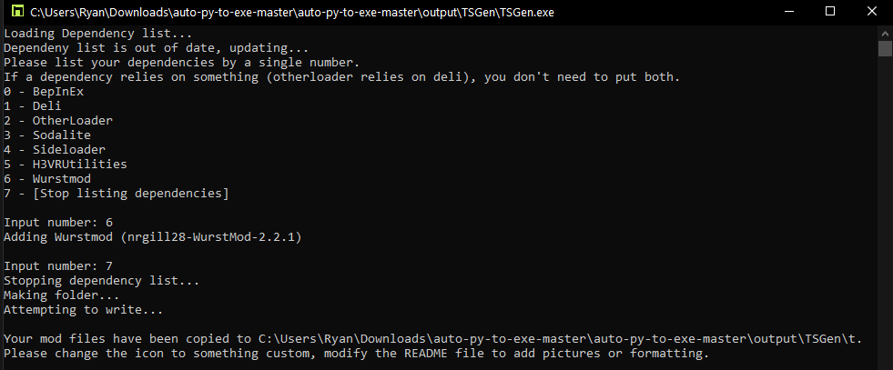

# Uploading a mod to Thunderstore

Thunderstore requires certain files to be present for it to even consider accepting your uploaded mod. Below are 3 sections, the first assumes you are making the files yourself, and the last 2 assume you want to use a tool to create them for you.

If you would like to update your mod, please see [Updating Your TS Mod](Updating-Your-TS-Mod.md).

If you would like to check your files before uploading, please see [TSGen.Check](https://github.com/nayr31/TSGen.Check).

- [Uploading a mod to Thunderstore](#uploading-a-mod-to-thunderstore)
  - [Required files for Thunderstore](#required-files-for-thunderstore)
  - [My mod is on Bonetome](#my-mod-is-on-bonetome)
  - [My mod isn't on Bonetome](#my-mod-isnt-on-bonetome)

**NOTE:** Windows defender or other antivirus programs may interfere with the mentioned programs, either run them as administrator or let them through temporarily.

## Required files for Thunderstore

Thunderstore requires 3 files to be present in your `.zip` upload:

- An icon for your mod
  - Must be 256x256 in dimensions
  - Must be named `icon.png`
  - It will be displayed on both r2modman and the main site, so make sure you don't have any small text
- A README file
  - Must be markdown called `README.md`
  - This file is displayed on your main page and tells people about your mod, and lets you add pictures.
  - It should follow [CommonMark](https://commonmark.org) syntax (although its just a formality)
- A TS manifest called `manifest.json`
  - This file requires a few fields to be filled out
  - `name`
    - Name of your mod, will be displayed beside your icon in the main page and on r2modman
    - What is determined when uploading your mod, if you change the name it will be considered another mod
    - Example: `"Cool mod 24"`
  - `description`
    - A short 250 character description of your mod
    - Shown on the mod list and below your mod through r2modman
    - Example: `"Some mod"`
  - `version_number`
    - The version of your mod in string format that follows [semantic versioning](https://semver.org)
    - Example: `"1.1.1"`
  - `dependencies`
    - A list of dependency strings that your mod depends on
    - These are found in the details section of the mod's main page
    - Example:

    ```json
    [
        "MythicManiac-TestMod-1.1.0",
        "SomeAuthor-SomePackage-1.0.0",
    ]
    ```
  
  - `website_url`
    - This is displayed on the main header of your mod page
    - Most commonly github links
    - Can be empty (use `""`)
    - Example: `"https://example.com/"`
  
    Example manifest:

    ```json
    {
        "name": "Cool mod 24",
        "version_number": "1.0.0",
        "website_url": "",
        "description": "Cool mod",
        "dependencies": [
            "MythicManiac-TestMod-1.1.0"
        ]
    }
    ```

Please see the [Thunderstore Packaging](Thunderstore-Packaging.md) page for details on how to place your mod into this file structure. After which, all you need to do is zip the files inside of the mod folder and upload it.

## My mod is on Bonetome

**NOTE:** This method only works when Bonetome is live, if it is down or your firewall blocks the site, use the [other method](#my-mod-isnt-on-bonetome) instead.

**CAUTION:** If you uploaded your mod as a `.7z`, make sure the program is listed in your system's `PATH`.

Since your mod is on Bonetome, you can use [Ebkr](https://github.com/ebkr)'s tool for generating the required files in the correct file structure called BT2TS ([Thunderstore](https://h3vr.thunderstore.io/package/ebkr/BT2TS/)) ([Github](https://github.com/ebkr/H3VR.BT2TS)).

Once downloaded, place `BT2TS.exe` and its `src/` folder inside of a folder you have permissions for. This can be done easily by creating a folder inside of your `Downloads/` folder. After running `BT2TS.exe`, you will be greeted by this screen:


After you input the Bonetome link of your mod, it will respond with the name of it and prompt you to include a short description of your mod:


Once inputted, you can add a website that will be displayed at the header of your mod page. This is mostly used for github pages, so you can leave this part blank (just press enter without typing anything). Below is an example of where this link is located:


Afterwards, you will be prompted with whether you want to package it for Thunderstore, or to use it for personal use. Type `1` and hit enter to create our required files.

You may be prompted for extra information depending on which type of mod `BT2TS` determines your mod to be.

**DONT PANIC:** After hitting enter, the window will close. This is normal.

If you had the correct permissions, it should create a folder beside `BT2TS.exe` called `[filenameOfYourMod]_build/`. Below is an example of a successful download:


If the program failed to create the folder of your mod, try running it as administrator or making sure your mods extension is supported by your OS.

Inside of the folder that was just created should be another folder named `plugins/` or `Sideloader/`, a `manifest.json` file, and a `README.md` file. You can open any of these and look around or change what your `README.md` file says (recommended to add pictures to your mod's main page, see the [markdown guide](https://www.markdownguide.org/basic-syntax/#images) to learn more).

After you are done, add an icon to the build folder named `icon.png` with a resolution of 256x256. It must be called this and have this resolution, failure to do so will result in your mod not being accepted by Thunderstore for upload.

Once you have added your icon, zip your files together and head on over to [Thunderstore](https://h3vr.thunderstore.io) to upload your mod. Make sure to log in, then press the `Upload` button in the top left. Set it's category, drag your `.zip`, and hit upload.

## My mod isn't on Bonetome

Head on over to [TSGen](https://github.com/nayr31/TSGen)'s github and download their latest release. You probably want to download `TSGen_Extract_This.zip` and extract it to it's own folder.

Running `TSGen.exe` will greet you with this page:


TSGen will prompt you for some general information about your mod:

- Mod name
- Version (It needs to be in the x.x.x format)
- Website url (usually for github links)
- Short description (displayed beside your mod in r2modman)
- Long description (displayed in the README file on the main page of your mod)

Next, it will prompt you for dependencies that your mod uses.


Input the number that corresponds to the top level dependencies you need.

Example:

```text
Mod A requires Wurstmod, Deli, and BepInEx

Wurstmod requires Deli

Deli requires BepInEx

So Mod A's dependencies are:
- Wurstmod
```



In the above picture you can see what the example would do in it's situation. You can close TSGen now by hitting enter or by closing the window.

Inside of the extracted TSGen folder, you should see a folder by the name of your mod:

```text
[You mod name]/
    icon.png
    manifest.json
    README.md
```

Please see the [Thunderstore Packaging](Thunderstore-Packaging.md) page for details on how to place your mod into this file structure.

Now that your files are compiled together, zip your files together and head on over to [Thunderstore](https://h3vr.thunderstore.io) to upload your mod. Make sure to log in, then press the `Upload` button in the top left. Set it's category, drag your `.zip`, and hit upload.
