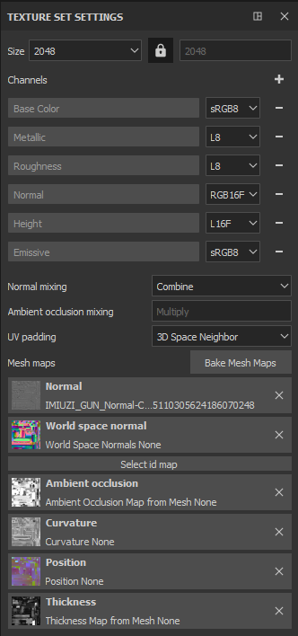
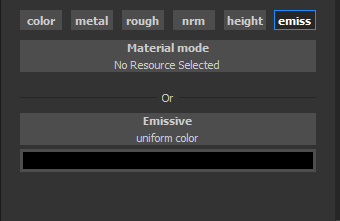
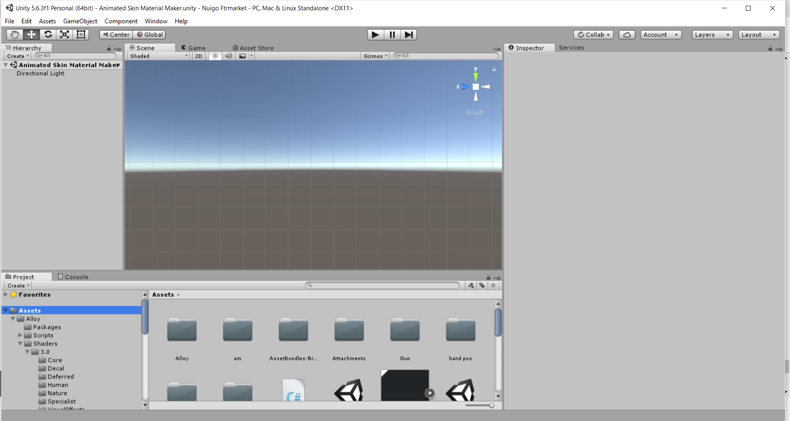
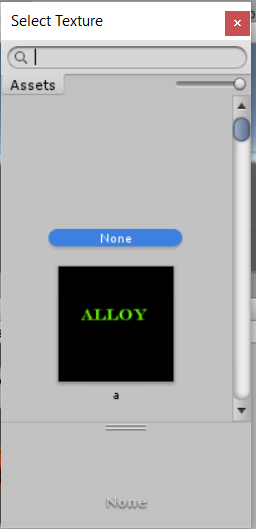
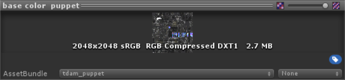
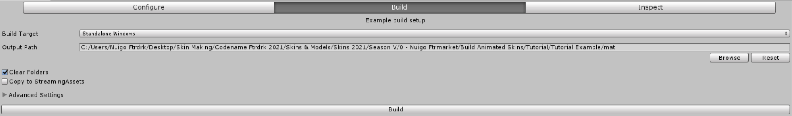
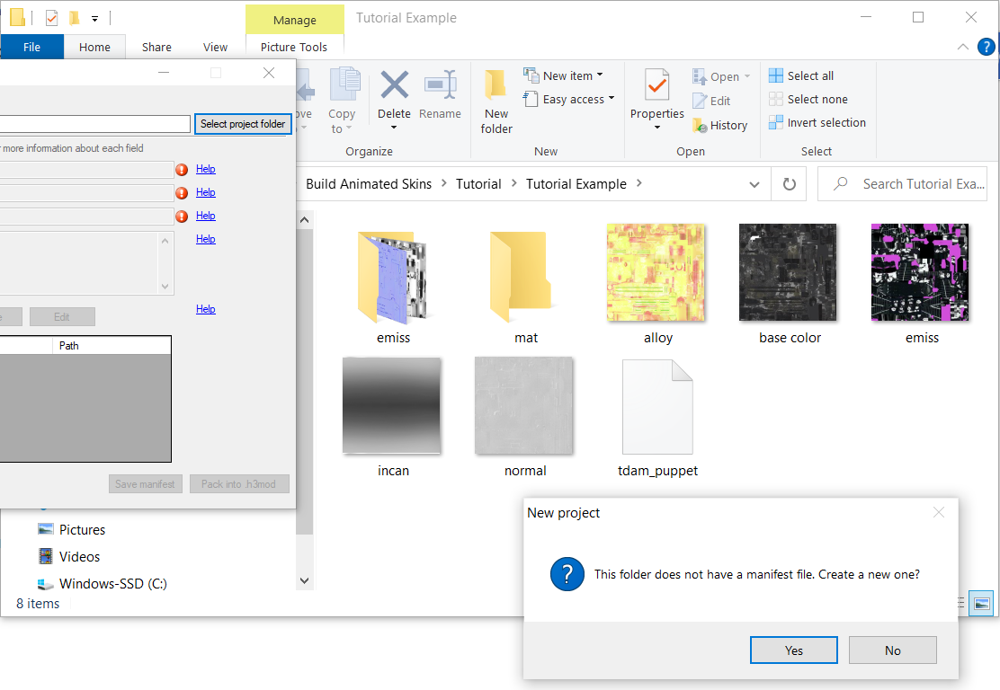
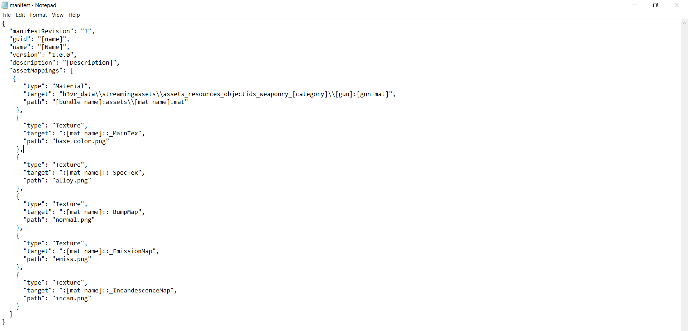
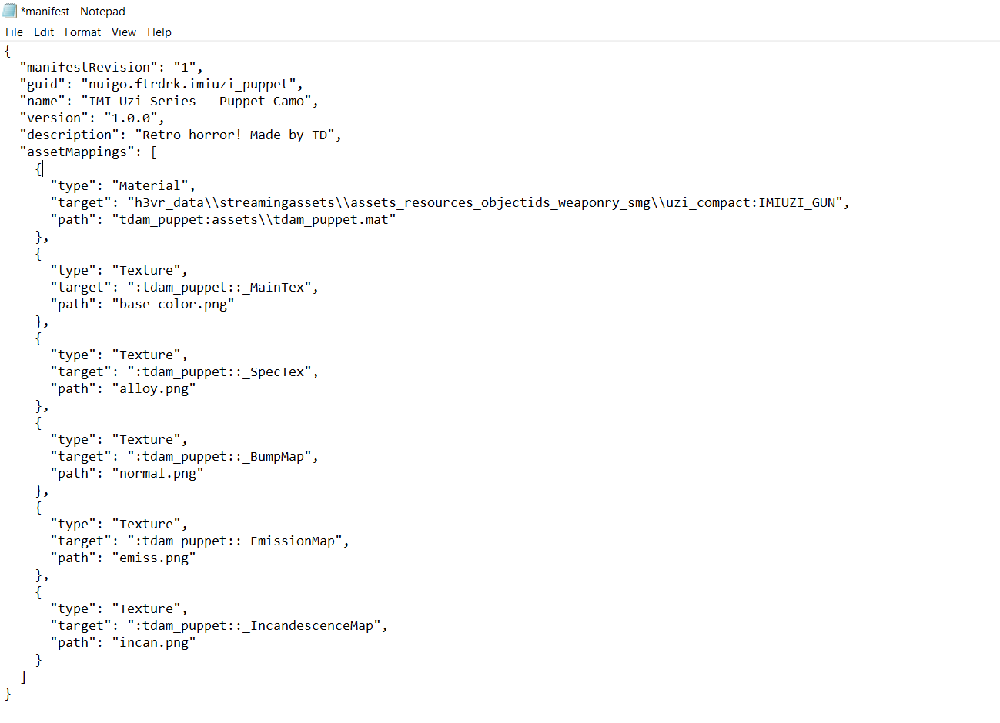

If you want to go the extra mile, you can make animated skins for H3VR as well. Before I explain how:

You'll be needing Unity in addition to what you currently have.

Oh, and Skinpacker won't work from this point on, sorry! You're going to need a ZIP Program!

[Unity 5.6.3f1](https://unity3d.com/get-unity/download/archive) is the version I used (Unity 5.x category).

You'll also need a template for H3VR stuffs, here is [one from PhoenixCraft99](https://drive.google.com/file/d/1bRHZrJxgPmE1PJGR_ty3i78mBfLTZQiB/view?usp=sharing).

Once you get these up and running, move on to the first step:

## Step 1 - Enabling Emissions for Substance Painter

At this point it is recommended for you to be using Substance Painter, so that the tutorial can be easily understood and things move smoothly.

On Substance Painter, you should have your canvas open with the usual instructions (New Canvas with Normal Texture, Bake Maps, Include Normal post-bake)

There is one addition to this process for when you want to make animated skins.

Over on these texture set settings, click on the plus sign next to "Channels


Select "Emissive"


Your result should look like this. With this, you have enabled Emissives for Substance Painter. Now, what to do with that...



## Step 2 - Applying Emissions (Automatic vs. Custom)

Now, there are two ways you can add Emissions to your canvas.

The easier way is through Materials and Smart Materials, the **Automatic** choice.

Some SMs and Materials come with emissions included in them. (There is a starter pack with SMs and Materials included in Extras!)

Drag n Drop. Boom. Done. Easy.

However, if you have a bit more in mind, you can make your own **Custom** Emissives.

First, make a new layer dedicated to these emissions.


Using the advanced tricks above, stamps and the material settings become handy. Notice the "emiss" selection? That's new, and that's what we'll need. Enable that, and if you want your stamp exclusively for the animated skin part, disable everything else,


After doing this, painting anything now will be included in an Emission category, and the Alloy export you're used to will not detect these emissions.



## Step 3 - Exporting... Twice!

After you make a skin, you need to export it a bit differently, too. You'll need to export twice.

Once with the **Alloy** Preset.


Then the next being with preset Document Channels.


I recommend having these exports in separate locations. My Alloy was sent here, but my second export I placed in the "emiss" folder. Don't you like having things organized? Me too.


Visiting said folder, this is what the export looks like. The only one we're interested in is our emission export, in which this example is called "None_Emissive".


I recommend renaming it to emiss before moving it with the alloy export. That's how you make an Emission! Now, the next part...


## Step 4 - Incandescence, the map of Animation

> [!NOTE]
> The starter pack will include a bundle of Incandescence PNGs, so you can skip this part if you already have one that works with your skin.

To bring these emissions to light, you need a fifth png. A black and white png that scrolls through the Emissive texture in variating opacities, giving it that "animated" effect.

To make it, you could even use Microsoft Paint! But for this example, we'll be using Photoshop.

For most Incandescence Maps, they are 512 x 512, a fourth of the size of the exports.


Start off with a black background, and make a picture of how you want your emissions revealed, then make that effect on here.


This is my example of an incandescence map, yours can be different, but so long as it follows the same rules (black and white, 512 x 512) it should work.


(If your canvas has a map that translates well, you could make a 2048 x 2048 map with variating Incandescence maps. However, this might not work for all canvases)

Save it as "incan.png" with the other four exports. Now that we have the last piece, we can move on to Unity!

## Step 5 - Unity, and what to do with it.

So, you should have Unity 5.6.3 installed by now, right?

If this is your first time using it, do not panic, you'll only be needing it for two minutes, honestly.

That being said, lemme state a few rules to this process that I've discovered the hard way:

**Rule 1)** Every animated skin you make, you need to make a new material for it. You CANNOT use the same material for two skins.

Using the same material on two skins will result in one skin being an abhorrent mess of the other skin's textures.

**Rule 2)** Every Material you make, you need to include new, unused PNGs for it. You CANNOT use the same PNGs for two skins.

This mainly applies to Incandescence Maps. We'll be talking about scroll speeds soon, but if you use the same incan.png, than there will be only one speed, not two.

Lets get started.

Opening Unity should result in something like this. Lets begin by making a subfolder in this main folder, "Assets", and I'll call this subfolder, "am" (for Animated Material)



In this subfolder "am", I'm going to make another folder based off of the skin I'm making. This subfolder will have my PNG exports.

The quick way would be to drag and drop your pngs in this category, but if you plan on making multiple animated skins, this will get clutter-some real quick.

Instead, make a copy of your exports, put them somewhere else, than add a codename to them.

After you give them a codename, import those pngs into the dedicated folder under **Assets --> am**


Yeah, making multiple animated skins, this is what it'll look like in the long run. Anyway...


So now that we have those pngs on Unity, go back to **Assets**...


Here is where I store my Animated Materials, and there is a reason behind it that we'll get to in the hotmodding step, but for now, follow my example.

Right click, and choose "Create"

A bunch of options will pop up, but we'll be looking for "Material"

A new material made, you're now going to want to look to the right.


The Shader set to "Standard" needs to be changed into "Alloy/Core". Left click the shader...


And locate the category "Alloy". Down this collection, look for "Core".


Your information should now change to something far more simple than prior. Phew! Nothing too crazy here!


Before we crack it open, we will need to add one more thing though. Look for the "plus" symbol next to the "Add Tab" category...

And select "**Emission**" to the categories.


Your result should be like this. Now, one more thing, there is a tint to this Emission category...


Bump that up to its max, at all white, for the full effect.


Alright! This material is ready to go!


Now, it's not gonna be called "new material" forever, but this next step is important.

> [!WARNING]
> The name you give your material will be needed for the hotmodding step, so keep it simple!

Lowercase, underscores, and keep it small. All my animated materials start with "tdam_" but yours can be different.

For this example, my material is called "tdam_puppet".

The only categories we'll be focused on in "Main Textures" and "Emission", these are where those PNG exports will go

Right next to the empty spaces are tiny circles, select them...

A popup should appear. (This is where the codenames come in handy, use the search bar to aid you)



Find the select pngs that go with each category. Base Color needs base color.png, Metal needs alloy.png, Normal needs normal.png--

Holup

When you apply the normal map, a prompt saying "fix now" appears. Tap that and we will continue


Now, to the Emissive.

Mask needs emiss.png, and Effect needs incan.png--

STOP


There is more to that Incandescence Map. Mainly, the scroll effect.

X and Y, X is horizontal scroll, and Y is vertical

X --> -numbers go left, +numbers go right

Y --> -numbers go down, +numbers go up

My example is .12 but yours can be anything else (within the limits between 0 and 1/-1)

If you forget this, your skin won't be animated, so don't forget!

Now that you have your pngs inside this material, lets address the elephant in the room.


Asset Bundles. "None" needs to go. You'll be renaming it to something else, and that name does matter, so I HIGHLY recommend you use the same name as your material.


Select "New...", then name it as you will, but I'll be naming mine the same as the material.

Visit your pngs and include them in the same bundle as the one you made.



Lastly, there is something included with your template. The Core shader. That needs to be included as well, elsewise...


This happens.


So be sure you have included for every skin you make!


Up above look for "Window"


A lot of options come up, but you're going to be selecting "**AssetBundle Browser**"


A new pop up will appear. Yours won't have as many categories, but the one we're focused on is the current bundle, which we named the same as our material, right?


A good time to check to see if you have everything. Seven things: Material, Shader, and the five PNGs you have.


If you have these seven things, move on to the "**Build**" option.

Now, this is the Unity Export. The result will be a file that will be used for the hotmod, and this file will enable animated skins for that weapon.



That being said, another recommendation, make a folder called "mat" where you have your textures located.

Make this the place where you export. Back on Unity, browse and locate this "mat" folder, then build it.


It takes my computer a half a minute, your mileage may vary.

Once built, you are all done!

Now... The hotmodding..

## Step 6 - Hotmod the results

(An example manifest and a manifest template will be included in the starter pack!)

In you "mat" folder, bring out the file built by Unity.

Homestretch. Five PNGs, one "Material" file... Now we need a manifest.


Open SkinPacker, and locate this location, and have it generate a manifest for you.

guid - "a"

name - "a"

version - "1.0.0"

save manifest

Why the low effort? Unfortunately, I have some bad news.

You cannot use SkinPacker here...

Skinpacker only works with Textures. It kicks the can when you include anything else.

So, after saving the manifest, close SkinPacker.

We're gonna get hands on now...

Open the Manifest.

It should look something like this, right?



Here's an incoming wall of text that you'll be copying and replacing these details, because, good news!

The format of making animated skins this way is near identical to one another!

```json
{
  "manifestRevision": "1",
  "guid": "[name]",
  "name": "[Name]",
  "version": "1.0.0",
  "description": "[Description]",
  "assetMappings": [
   {
      "type": "Material",
      "target": "h3vr_data\\streamingassets\\assets_resources_objectids_weaponry_[category]\\[gun]:[gun mat]",
      "path": "[bundle name]:assets\\[mat name].mat"
    },
    {
      "type": "Texture",
      "target": ":[mat name]::_MainTex",
      "path": "base color.png"
    },
    {

      "type": "Texture",
      "target": ":[mat name]::_SpecTex",
      "path": "alloy.png"
    },
    {
      "type": "Texture",
      "target": ":[mat name]::_BumpMap",
      "path": "normal.png"
    },
    {
      "type": "Texture",
      "target": ":[mat name]::_EmissionMap",
      "path": "emiss.png"
    },
    {
      "type": "Texture",
      "target": ":[mat name]::_IncandescenceMap",
      "path": "incan.png"
    }
  ]
}
```

Copy that json for your manifest.

Now that it's like this, lets break it down.



Guid --> Sideloader ID, needs to be lowercase and with either underscores or periods, no spaces

Name & Description --> self-explanatory

Target is very important, the trickiest part of this process... this is the prefab path and material name of the gun you are making a skin for.

To assist, use [this spreadsheet](https://docs.google.com/spreadsheets/d/1Mjeo410-2wgou9JHSb_I1VltNTyzNXZX_EwhMNsfH6Y/edit#gid=1966002968) made by Ghorsington.

But for my example, I am making a skin for the Uzi, so my target would be


**Category** becomes "Smgs" , **Gun** becomes uzi, and **gun mat** becomes IMIUZI_GUN


Target's down, next is path.

If you named your asset bundle and material name the same, and have your material in the assets folder just as this tutorial instructed, then this is going to be a sinch!

However, if you stored your material in a subfolder of "Assets", it's gonna be a bit more tricky

`[bundle name]:assets\\[mat name].mat` --> `[bundle name]:assets\\[subfolder]\\[mat name].mat`

This is why I keep it in assets because it makes it less confusing!

ANYWAY

The name you used on both is what **bundle name** and **mat name** becomes!

My example is "tdam_puppet", so I replace it all [] portions with tdam_puppet.

Here is the final product of my example, yours should hopefully follow the same pattern!



Save the manifest and exit out.

The final step of the final step is to manually make a hotmod.

Select all seven items in your folder, the five textures, the manifest, and the unity file we dubbed as the "material" file.


Use a ZIP program [WINRAR, Bandizip, etc] to package all the materials into a ZIP.

Rename the .zip to .hotmod or .h3mod

And it's ready to go! That's the process of making animated skins for H3VR! Hope it wasn't too taxing and I hope you make the most of it!